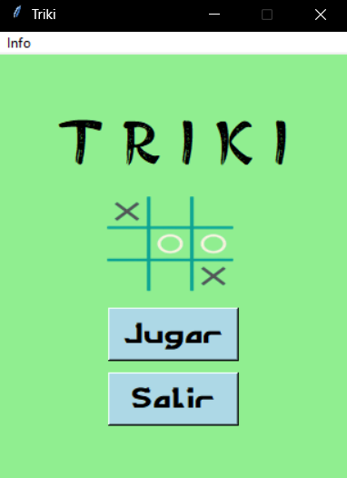

# Triki_MT_ER
En este repositorio encuentras el tan famoso juego Triki creado de una forma un tanto diferente.
Se hace mediante el uso de una máquina de Turing que transforma las cadenas que va recibiendo después de cada movimiento en una cadena que tiene forma compatible con el tablero; posteriormente dicha cadena se compara en cada movimiento con un banco de expresiones regulares para las cadenas acepatadas como "victoria".

También cuenta con una interfaz gráfica para que verifiques su funcionamiento y difrutes jugando!

**Nota:** Se deben instalar las librerias automata-lib y pillow de python.
